# Manual de Usuario — SIGECAT

Este manual está dirigido a los usuarios finales del sistema SIGECAT, tanto en el rol **Administrador** como en el rol **Funcionario/Empleado**. Su objetivo es que cualquier persona pueda usar las funcionalidades principales del sistema sin depender de soporte técnico.

> **Nota sobre las capturas de pantalla:** este documento incluye espacios reservados para imágenes (``). Para completarlo, toma la captura indicada y guárdala con el nombre de archivo exacto dentro de la carpeta `docs/screenshots/` (créala si no existe). Al guardar la imagen con ese nombre, se mostrará automáticamente en el manual.

---

## Índice

1. [Acceso al sistema](#1-acceso-al-sistema)
2. [Roles y permisos](#2-roles-y-permisos)
3. [Registro de horas (Cargas de Trabajo)](#3-registro-de-horas-cargas-de-trabajo)
4. [Gestión administrativa (CRUDs)](#4-gestión-administrativa-cruds)
   - [4.1 Usuarios](#41-usuarios)
   - [4.2 Áreas](#42-áreas)
   - [4.3 Departamentos](#43-departamentos)
   - [4.4 Secciones](#44-secciones)
   - [4.5 Unidades](#45-unidades)
   - [4.6 Cargos](#46-cargos)
   - [4.7 Plazas](#47-plazas)
5. [Ajustes de la cuenta](#5-ajustes-de-la-cuenta)
6. [Cerrar sesión](#6-cerrar-sesión)
7. [Preguntas frecuentes](#7-preguntas-frecuentes)

---

## 1. Acceso al sistema

### 1.1 Iniciar sesión

1. Abra el sistema SIGECAT en su navegador. Será dirigido a la pantalla de inicio de sesión.
2. Ingrese su **correo institucional** (formato `usuario@ucr.ac.cr`).
3. Ingrese su **contraseña**. Puede pulsar el ícono de ojo para mostrar u ocultar el texto.
4. Pulse **"Iniciar sesión"**.

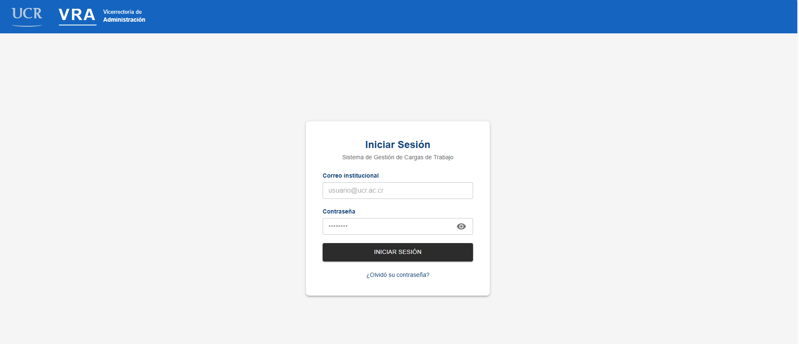
<!-- 📸 CAPTURA PENDIENTE: pantalla completa de /login con los campos "Correo institucional" y "Contraseña" vacíos. -->

**Posibles mensajes de error:**

| Situación | Mensaje |
|---|---|
| El correo no es institucional | "El correo debe ser institucional (@ucr.ac.cr)." |
| No se ingresó contraseña | "La contraseña es requerida." |
| Credenciales incorrectas | Mensaje de error devuelto por el servidor |

**Qué sucede después de iniciar sesión:**
- Si es la primera vez que ingresa (contraseña temporal asignada por un administrador), el sistema lo llevará automáticamente a la pantalla **Cambiar contraseña** (ver sección 1.4) antes de permitirle continuar.
- En caso contrario, será dirigido a la pantalla de inicio correspondiente a su rol.

### 1.2 Recuperar contraseña olvidada

Si olvidó su contraseña, puede solicitar restablecerla sin necesidad de soporte técnico:

1. En la pantalla de inicio de sesión, pulse el enlace **"¿Olvidó su contraseña?"**.
2. Ingrese su correo institucional y pulse **"Enviar enlace de recuperación"**.

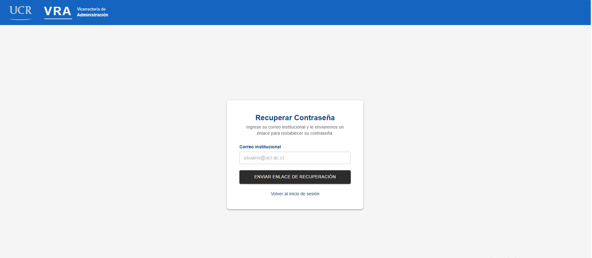
<!-- 📸 CAPTURA PENDIENTE: pantalla de /recuperar-contrasena con el campo de correo. -->

3. El sistema mostrará el mensaje: *"Si su correo está registrado, recibirá un enlace para restablecer su contraseña. Revise su bandeja de entrada."*
   - Este mensaje aparece siempre, exista o no una cuenta con ese correo, por motivos de seguridad.
4. Revise su correo institucional. Recibirá un mensaje con un botón/enlace para crear una nueva contraseña.

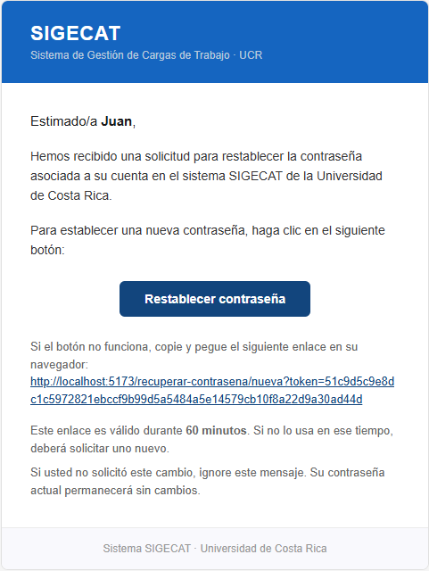
<!-- 📸 CAPTURA PENDIENTE: captura del correo electrónico recibido, mostrando el botón/enlace de recuperación. -->

5. Al hacer clic en el enlace del correo, se abrirá la pantalla **Restablecer contraseña**.
6. Ingrese su **nueva contraseña** y luego **confírmela** en el segundo campo.
   - Mientras escribe, el sistema muestra una barra de fortaleza de contraseña con los requisitos pendientes y cumplidos.

**Requisitos de la nueva contraseña:**
- Mínimo 8 caracteres
- Al menos una letra mayúscula
- Al menos un número
- Al menos un carácter especial (por ejemplo: `!`, `@`, `#`, `$`)

*Ejemplo de contraseña válida:* `Ucr2026!`

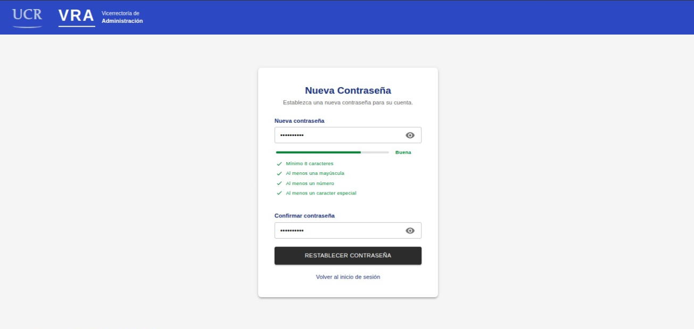
<!-- 📸 CAPTURA PENDIENTE: pantalla de /recuperar-contrasena/nueva mostrando los campos "Nueva contraseña" / "Confirmar contraseña" y el indicador de fortaleza. -->

7. Pulse **"Restablecer contraseña"**.
8. Si todo es correcto, verá el mensaje *"Su contraseña ha sido actualizada exitosamente. Puede iniciar sesión con su nueva contraseña."* y será redirigido al inicio de sesión.

**Si el enlace ya no es válido:**
- Si el enlace expiró o ya fue utilizado, el sistema mostrará: *"El enlace de recuperación no es válido o ha expirado."* junto con un botón **"Solicitar un nuevo enlace"**. Repita el proceso desde el paso 1.

### 1.3 Errores comunes al restablecer la contraseña

| Situación | Mensaje |
|---|---|
| Las contraseñas no coinciden | "Las contraseñas no coinciden." |
| La nueva contraseña no cumple los requisitos | Se indica en la barra de fortaleza qué requisito falta |

### 1.4 Cambiar la contraseña temporal (primer ingreso)

Cuando un administrador crea su cuenta, le asigna una contraseña temporal. La primera vez que inicia sesión con ella, el sistema le pedirá cambiarla antes de continuar:

1. Ingrese su **contraseña actual** (la temporal que le brindaron).
2. Ingrese su **nueva contraseña** y **confírmela**.
3. Pulse **"Cambiar contraseña"**.

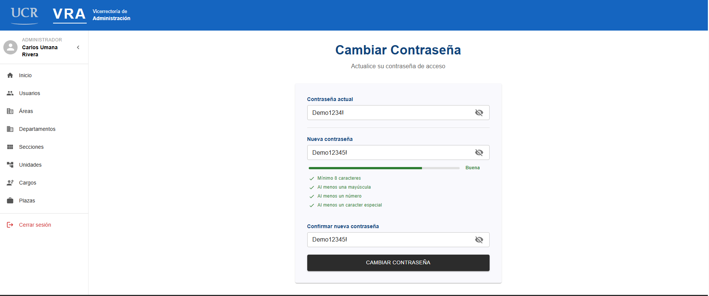
<!-- 📸 CAPTURA PENDIENTE: pantalla de /cambiar-contrasena. -->

**Mensajes:**

| Situación | Mensaje |
|---|---|
| Contraseña actual incorrecta | "La contraseña actual es incorrecta." |
| Cambio exitoso | "Su contraseña ha sido cambiada exitosamente." |

---

## 2. Roles y permisos

SIGECAT tiene dos roles de usuario, asignados por un administrador:

| Rol | Etiqueta en el sistema | Acceso |
|---|---|---|
| **Administrador** | "ADMINISTRADOR" | Inicio, Usuarios, Áreas, Departamentos, Secciones, Unidades, Cargos, Plazas, Ajustes |
| **Funcionario/Empleado** | "FUNCIONARIO" | Inicio (registro de cargas de trabajo) y Ajustes |

Su rol determina qué opciones ve en el menú lateral. Si intenta acceder directamente a una dirección para la que no tiene permiso, el sistema mostrará una pantalla de **Acceso denegado (403)** con la opción de volver al inicio.

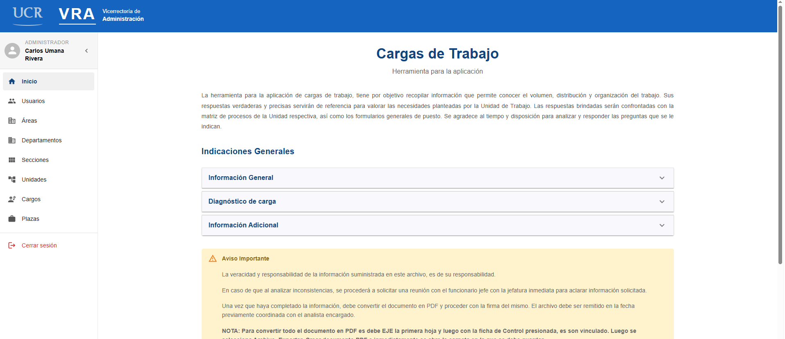
<!-- 📸 CAPTURA PENDIENTE: sidebar completo logueado como ADMIN, mostrando todas las opciones. -->

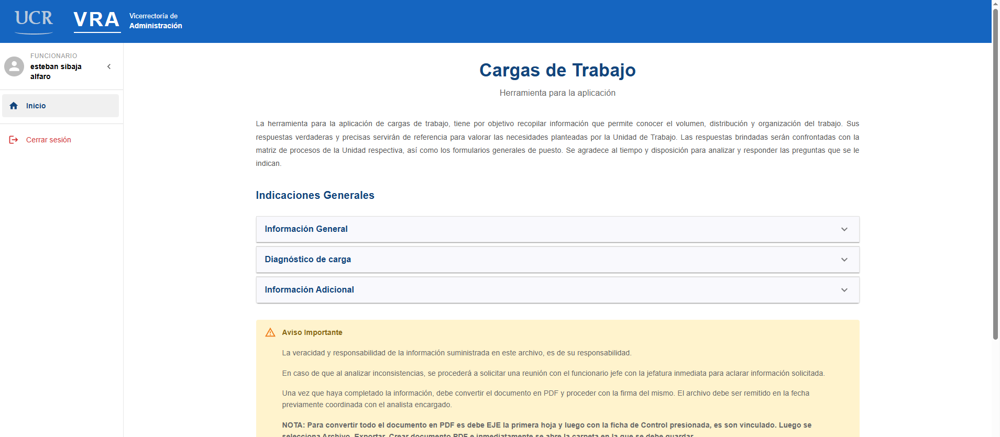
<!-- 📸 CAPTURA PENDIENTE: sidebar completo logueado como EMPLOYEE, mostrando solo "Inicio" y "Ajustes". -->

---

## 3. Registro de horas (Cargas de Trabajo)

Esta funcionalidad permite a cualquier funcionario declarar las tareas y horas dedicadas a su puesto. Consta de tres pantallas en secuencia.

### Paso 1 — Pantalla de inicio

1. Al iniciar sesión, el funcionario llega a la pantalla **"Cargas de Trabajo"**.
2. Lea las indicaciones generales, disponibles en tres secciones desplegables: **"Información General"**, **"Diagnóstico de carga"** e **"Información Adicional"**.
3. Tome en cuenta el aviso importante: la información que declare es de su responsabilidad, y en la fecha coordinada deberá entregar tanto el documento firmado en PDF como el archivo en Excel.
4. (Opcional) Pulse **"Marcar como leído"** para confirmar que revisó las indicaciones.
5. Pulse **"Comenzar"** para iniciar el formulario.

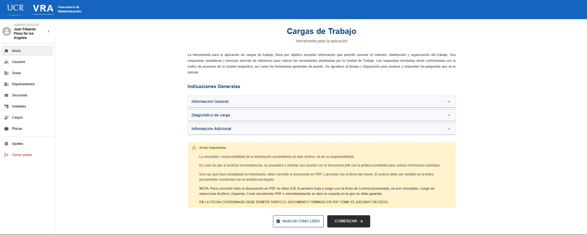
<!-- 📸 CAPTURA PENDIENTE: pantalla de inicio (/) con las indicaciones generales y el botón "Comenzar". -->

### Paso 2 — Información general

En esta pantalla se muestran sus datos personales obtenidos automáticamente del sistema institucional (SSO): nombre completo, cédula, correo institucional, código de empleado y relación con la UCR. **Estos campos no se pueden editar.**

1. Verifique que la información sea correcta.
2. Pulse **"Siguiente"** para continuar, o **"Atrás"** para volver al inicio.

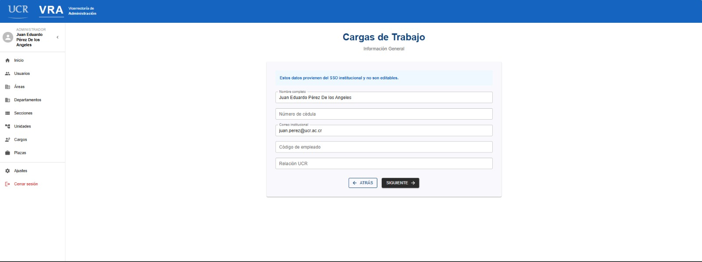
<!-- 📸 CAPTURA PENDIENTE: pantalla de /employee-form con los datos de solo lectura. -->

### Paso 3 — Registro de horas y declaración de jornada

1. **Objetivo del puesto:** describa en el cuadro de texto el objetivo de su puesto. Este campo es obligatorio.
2. **Tabla de tareas y horas:** por cada tarea que realiza, agregue una fila con:
   - **Día** (texto libre, por ejemplo "Lunes")
   - **Tipo de tarea**: "Propias", "De apoyo" u "Otros"
   - **Hora inicio** y **Hora final**
   - El sistema calcula automáticamente las **horas y minutos** trabajados en esa fila.
   - Use el botón **"Agregar fila"** para declarar más tareas, y el ícono de papelera para eliminar una fila (no se puede eliminar si solo queda una).
3. **Jornada laboral:** complete la declaración de la magnitud de su jornada.
4. **Funciones de la jornada:** busque y seleccione funciones del catálogo, o agregue funciones personalizadas si la suya no aparece en la lista.
5. **Permisos y licencias:** declare cualquier permiso o licencia aplicable.
6. Pulse **"Completar"** para guardar el registro, o **"Atrás"** para volver a la pantalla anterior.

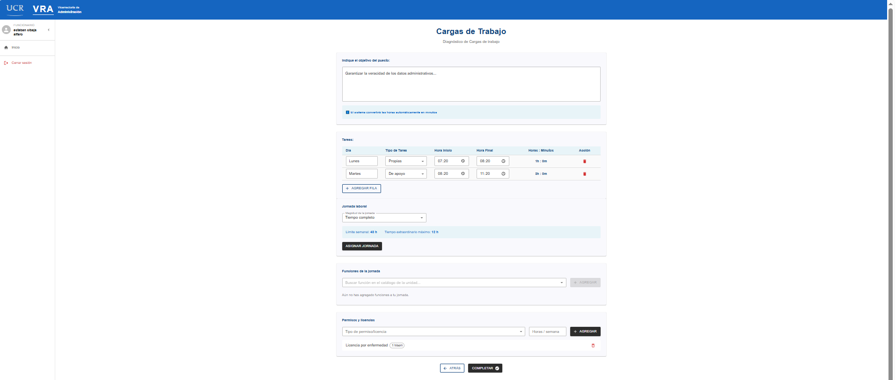
<!-- 📸 CAPTURA PENDIENTE: pantalla de /work-hours mostrando el objetivo del puesto y la tabla de tareas con al menos 2 filas llenas. -->

7. Al guardar correctamente, verá el mensaje **"Registro guardado exitosamente"** y será redirigido automáticamente al inicio.

> **Importante:** el sistema convierte automáticamente las horas declaradas en minutos para los cálculos internos; usted solo necesita ingresar la hora de inicio y de fin de cada tarea.

---

## 4. Gestión administrativa (CRUDs)

Las siguientes secciones solo están disponibles para usuarios con rol **Administrador**. Cada una sigue el mismo patrón:

- Una barra superior con un campo de **búsqueda** y un botón **"Añadir [entidad]"**.
- Una **lista/tabla** de registros existentes, paginada de 10 en 10.
- Iconos de acción por fila: **lápiz** (editar), **papelera** (eliminar) y, en algunos casos, **ojo** (ver detalle).
- Al eliminar, siempre se solicita confirmación en una ventana emergente.

### 4.1 Usuarios

**Ruta:** Menú lateral → "Usuarios"

**Crear un usuario:**

1. Pulse **"Añadir usuario"**.
2. Complete el formulario:
   - **Primer nombre** (obligatorio)
   - **Segundo nombre** (opcional)
   - **Primer apellido** (obligatorio)
   - **Segundo apellido** (obligatorio)
   - **Correo institucional** (obligatorio, debe terminar en `@ucr.ac.cr`)
   - **Rol**: "Administrador" o "Empleado" (obligatorio)
   - **Contraseña temporal** (obligatorio): el usuario deberá cambiarla en su primer ingreso.
3. Pulse **"Confirmar"**.

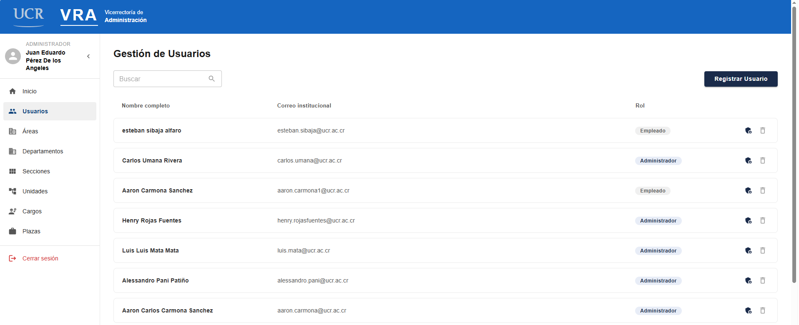
<!-- 📸 CAPTURA PENDIENTE: tabla de /usuarios con columnas Nombre completo, Correo institucional, Rol. -->

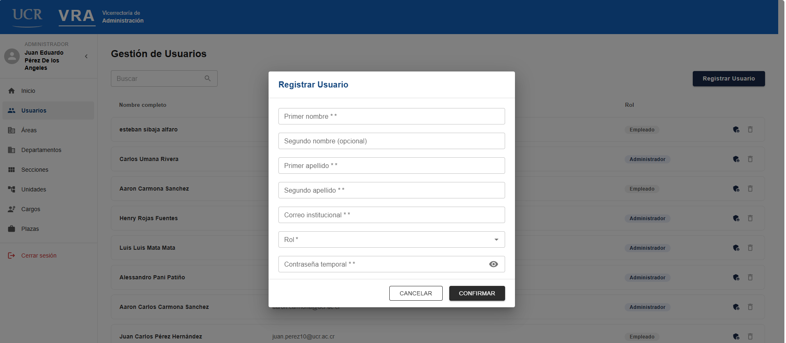
<!-- 📸 CAPTURA PENDIENTE: modal de creación de usuario con todos los campos visibles. -->

**Cambiar el rol de un usuario:**

1. Pulse el ícono de engranaje en la fila del usuario.
2. Seleccione el nuevo rol ("Administrador" o "Empleado").
3. Confirme. Verá el mensaje **"Rol actualizado correctamente."**

**Eliminar un usuario:**

1. Pulse el ícono de papelera en la fila del usuario.
2. Confirme en el mensaje: *"¿Está seguro que desea eliminar a '[Nombre Apellido]'? Esta acción no se puede deshacer."*

**Buscar usuarios:** el campo de búsqueda filtra en tiempo real por nombre, apellido, correo o rol.

### 4.2 Áreas

**Ruta:** Menú lateral → "Áreas"

**Crear/editar:**
- **Nombre** (obligatorio)
- **Descripción** (opcional)

**Eliminar:** confirmación con el mensaje *"¿Está seguro que desea eliminar '[nombre]'? Esta acción no se puede deshacer."*

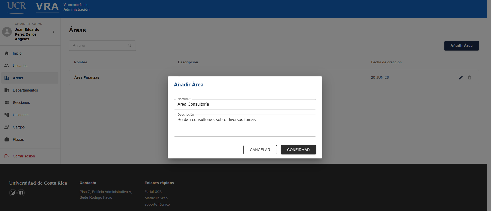
<!-- 📸 CAPTURA PENDIENTE: tabla de /areas y el modal de creación/edición. -->

### 4.3 Departamentos

**Ruta:** Menú lateral → "Departamentos"

**Crear/editar:**
- **Nombre del departamento** (obligatorio)
- **Área a la que pertenece** (obligatorio, se elige de una lista desplegable de áreas existentes)
- **Descripción** (opcional)

**Eliminar:** el mensaje de confirmación advierte: *"¿Está seguro de que desea eliminar este departamento? Se desvincularán las unidades asociadas."*

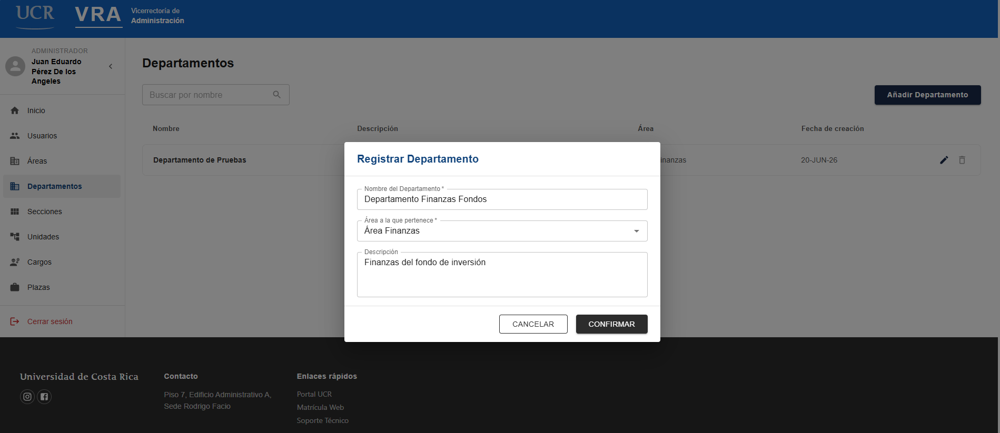
<!-- 📸 CAPTURA PENDIENTE: tabla de /departamentos y el modal de creación/edición, mostrando el selector de área. -->

### 4.4 Secciones

**Ruta:** Menú lateral → "Secciones"

**Crear/editar:**
- **Nombre de la sección** (obligatorio)
- **Área a la que pertenece** (obligatorio)
- **Descripción** (opcional)

**Eliminar:** confirmación con el mensaje *"¿Está seguro que desea eliminar la sección '[nombre]'? Esta acción no se puede deshacer."*

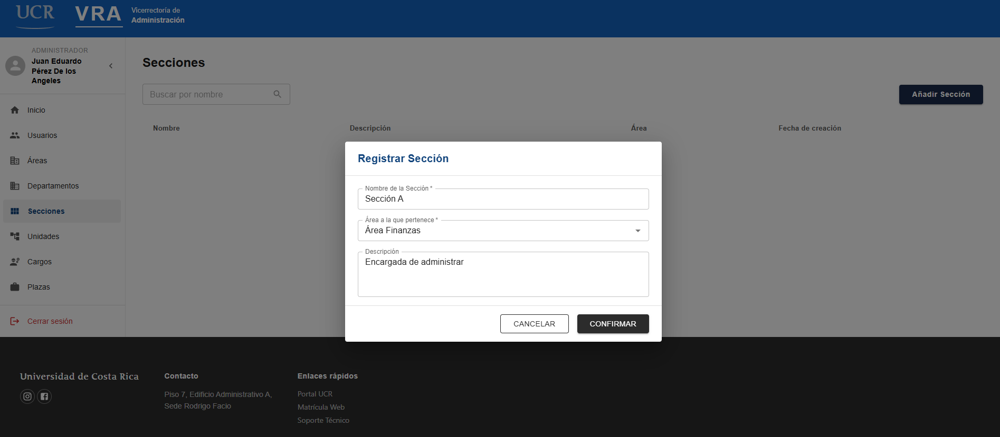
<!-- 📸 CAPTURA PENDIENTE: tabla de /secciones y el modal de creación/edición. -->

### 4.5 Unidades

**Ruta:** Menú lateral → "Unidades"

**Crear/editar:**
- **Nombre** (obligatorio)
- **Tipo de asignación** (obligatorio): "Departamento" o "Sección". *No se puede modificar una vez creada la unidad.*
- **Entidad**: según el tipo elegido, se debe seleccionar el departamento o sección correspondiente.
- **Descripción** (opcional)

**Eliminar:** confirmación con el mensaje *"¿Está seguro que desea eliminar '[nombre]'? Esta acción no se puede deshacer."*

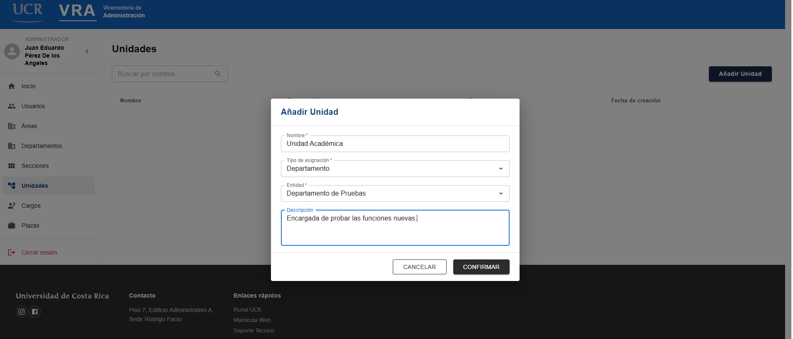
<!-- 📸 CAPTURA PENDIENTE: tabla de /unidades y el modal de creación/edición, mostrando los selectores "Tipo de asignación" y "Entidad". -->

### 4.6 Cargos

**Ruta:** Menú lateral → "Cargos"

**Crear/editar:**
- **Código del cargo** (obligatorio, número entero entre 0 y 200000)
- **Nombre del cargo** (obligatorio, máximo 110 caracteres)
- **Clase ocupacional** (obligatorio, se elige de un catálogo)
- **Descripción** (opcional, máximo 255 caracteres)

**Ver detalle:** pulse el ícono de ojo para visualizar la información del cargo sin poder editarla.

**Eliminar:** el mensaje de confirmación advierte: *"¿Está seguro de que desea eliminar el puesto '[nombre]'? Esta acción afectará a las plazas vinculadas."*

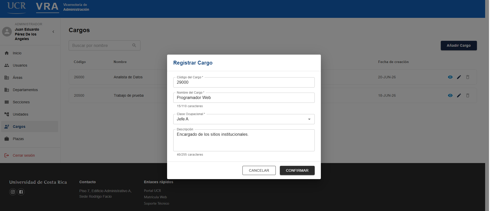
<!-- 📸 CAPTURA PENDIENTE: tabla de /cargos y el modal de creación/edición. -->

### 4.7 Plazas

**Ruta:** Menú lateral → "Plazas"

**Crear/editar:**
- **Número de plaza** (obligatorio, solo números, máximo 10 dígitos)
- **Tipo de plaza** (obligatorio, se elige entre los cargos existentes)
- **Usuario asignado** (obligatorio, se elige de la lista de usuarios, formato "Nombre Apellido (correo@ucr.ac.cr)")
- **Turno** (obligatorio): "Diurna", "Media Diurna", "Mixta", "Nocturna" o "Media Nocturna"
- **Tipo de entidad** (obligatorio): "Área", "Departamento", "Sección" o "Unidad"
- **Entidad** (obligatorio, depende del tipo de entidad elegido — al cambiar el tipo, se limpia esta selección)
- **Descripción** (opcional, máximo 255 caracteres)

**Ver detalle:** ícono de ojo, igual que en Cargos.

**Eliminar:** confirmación con el mensaje *"¿Está seguro que desea eliminar la plaza '[número]'? Esta acción no se puede deshacer."*

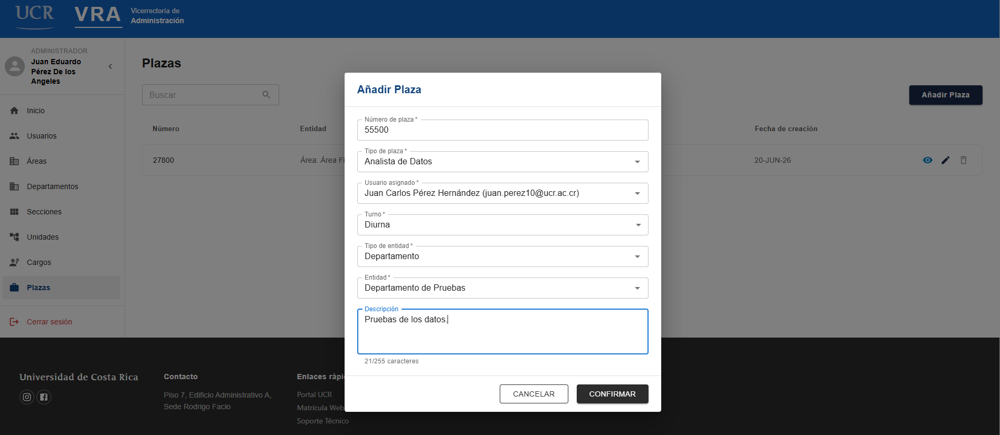
<!-- 📸 CAPTURA PENDIENTE: tabla de /plazas y el modal de creación/edición, mostrando todos los selectores. -->

---

## 5. Ajustes de la cuenta

**Ruta:** pulse su nombre/avatar en el menú lateral, o vaya a "Ajustes".

Disponible para todos los usuarios (administradores y funcionarios).

**Información personal** (solo lectura): nombre, apellidos y correo institucional.

**Seguridad de la cuenta:**
1. Ingrese su **contraseña actual**.
2. Ingrese y confirme su **nueva contraseña** (debe cumplir los mismos requisitos descritos en la sección 1.2).
3. Pulse **"Cambiar Contraseña"**.

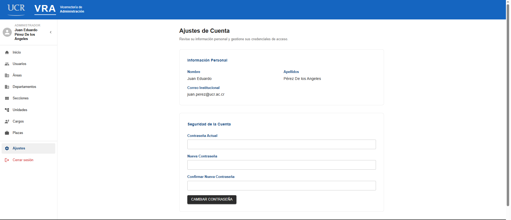
<!-- 📸 CAPTURA PENDIENTE: pantalla de /ajustes completa, con la sección de información personal y la de seguridad de la cuenta. -->

**Mensajes:**

| Situación | Mensaje |
|---|---|
| Contraseña actual incorrecta | "Error al cambiar la contraseña." |
| Cambio exitoso | "Su contraseña ha sido cambiada de forma segura." |

---

## 6. Cerrar sesión

1. Pulse **"Cerrar sesión"** en la parte inferior del menú lateral.
2. Confirme la acción si el sistema lo solicita.
3. Será redirigido a la pantalla de inicio de sesión.

---

## 7. Preguntas frecuentes

**¿Qué hago si no recuerdo mi correo institucional?**
Contacte a su administrador de SIGECAT; solo un administrador puede consultar o corregir los datos de su cuenta.

**¿Qué hago si el enlace de recuperación de contraseña no llega a mi correo?**
Revise su carpeta de spam/correo no deseado. Si después de varios minutos no lo recibe, repita el proceso de la sección 1.2. Si el problema persiste, contacte a soporte técnico.

**Inicié sesión pero no veo las opciones de administración (Usuarios, Áreas, etc.)**
Esto es normal si su rol es "Funcionario". Solo los usuarios con rol "Administrador" ven esas opciones. Si considera que debería tener acceso, contacte a un administrador para que le actualice el rol.

**Quiero corregir un registro de horas que ya completé.**
Actualmente el formulario de registro de horas no permite edición posterior desde esta interfaz. Contacte a su administrador para coordinar la corrección.

**¿Qué significa "Acceso Denegado (403)"?**
Indica que intentó acceder a una sección para la cual su rol no tiene permisos. Pulse "Volver al inicio" para regresar a una sección disponible para usted.

---

*Última actualización: junio 2026. Si una pantalla del sistema cambia, actualice este manual y sus capturas de pantalla correspondientes.*
